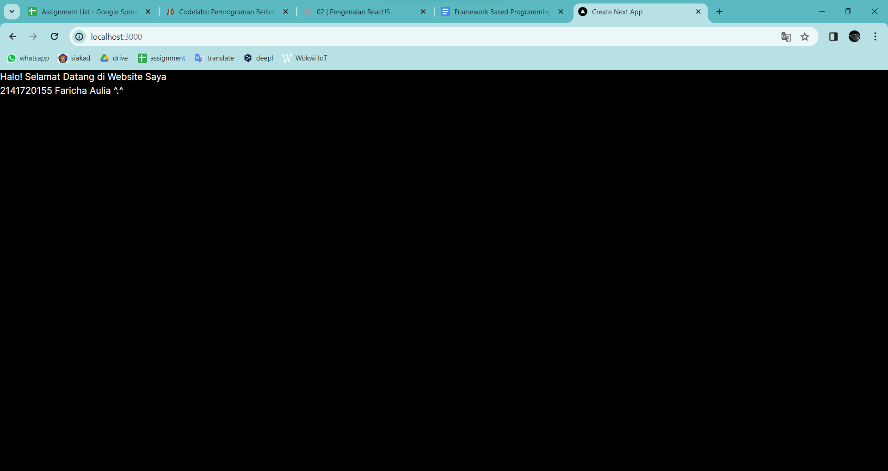

# Laporan Praktikum
| MatKul | Pemrograman Berbasis Framework | 
| ---    | ---           |
| Nama   | Faricha Aulia |
| NIM    | 2141720155    |
| Kelas  | TI - 3I       |

<table><tr><td>Saya melampirkan screenshot dari setiap step yang saya lakukan pada src/assets</td></tr></table>

## Pertanyaan 1 dan Jawaban

> "Browsing apa yang dimaksud dengan: TypeScript, ESLint, Tailwind CSS, App Router, Import alias."

**TypeScript  :** Bahasa pemrograman yang dibangun di atas JavaScript dengan menambahkan typing dan fitur lainnya. Memungkinkan kode JavaScript diskalakan dengan lebih baik. 
Contoh: 
```typescript
let foo: string = "Hello";
```

**ESLint :** Alat untuk menganalisis kode JavaScript/TypeScript dan mencari masalah gaya penulisan atau bug potensial. Membantu menjaga kualitas kode.

**Tailwind CSS :** Framework CSS utilitas-first yang menyediakan kelas utilitas seperti flex, pt-4, text-center, dll. Memudahkan styling tanpa perlu menulis banyak CSS custom. 
Contoh:
```html
<div class="flex justify-center pt-4 text-center">
    Konten 
</div>
```

**App Router :** Komponen di React/NextJS dll yang menghandle routing dan navigasi di aplikasi. 
Contoh di NextJS:
```javascript
import { useRouter } from 'next/router'
export default function Page() {
  const router = useRouter()
  return <div>{router.pathname}</div>
}
```

**Import Alias :** Fitur yang memungkinkan path relatif untuk import module. Membuat import lebih singkat. 
Contoh di NextJS:
```javascript
// next.config.js
const path = require('path');
module.exports = {
  webpack: (config) => {
    config.resolve.alias['@'] = path.resolve(__dirname)
    return config
  }
}
// Komponen
import Footer from '@/components/Footer'
```

---

## Pertanyaan 2 dan Jawaban

> "Penjelasan struktur project pada masing-masing file dan folder."

**node_modules :** Berisi semua dependency/paket npm yang diinstal untuk proyek. </br>
**public :** Folder untuk menyimpan aset statis seperti gambar yang akan diakses secara publik.</br>
**src :** Folder untuk kode sumber aplikasi, biasanya berisi component, halaman, util, dan lainnya. </br>
**.eslintrc.json :** Konfigurasi untuk ESLint, digunakan untuk mendefinisikan aturan pengecekan kode. </br>
**.gitignore :** File yang memberitahu Git file dan folder mana yang harus diabaikan dari version control. </br>
**next-env.d.ts :** File TypeScript definisi untuk variabel environment Next.js. </br>
**next.config.mjs :** File konfigurasi untuk proyek Next.js. </br>
**package-lock.json :** Berisi informasi versi eksak dari dependency yang diinstal. </br>
**package.json :** Daftar dependency/npm packages yang dibutuhkan proyek dan konfigurasinya. </br>
**postcss.config.js :** Konfigurasi untuk PostCSS, digunakan oleh Tailwind CSS. </br>
**README.md :** Berisi informasi dan dokumentasi tentang proyek. </br>
**tailwind.config.ts :** File konfigurasi untuk Tailwind CSS. </br>
**tsconfig.json :** Konfigurasi compiler untuk TypeScript, tentukan opsi kompilasi. </br>

--- 

## Pertanyaan 3 dan Jawaban

> "Modifikasi teks bagian atas."


> "Ketika Anda telah berhasil mengganti teks tersebut, Anda tidak perlu menjalankan perintah npm run dev dan tidak juga diperlukan me-reload halaman di browser. Tiba-tiba perubahan itu tampil, Mengapa terjadi demikian? Jelaskan!"

Perubahan teks di Next.js langsung terlihat tanpa perlu menjalankan npm run dev atau reload browser karena Next.js menggunakan React yang memiliki fitur Hot Module Replacement (HMR).

Fitur HMR memungkinkan kode JavaScript/React diperbarui secara real-time tanpa memuat ulang seluruh halaman. Ketika terjadi perubahan pada kode sumber, webpack akan secara otomatis mendeteksi perubahan tersebut dan memperbarui modul JavaScript yang telah berubah secara instan di browser tanpa mereload halaman.

Prosesnya seperti ini:
1. Melakukan perubahan pada kode sumber (misal jika saya di 'src\app\page.tsx')
2. Webpack mendeteksi ada file yang berubah dan mulai proses kompilasi ulang.
3. Bundle JavaScript yang sudah diperbarui dikirim ke browser dan menggantikan bundle lama.
4. React akan melakukan reconciliation untuk memperbarui komponen yang terdampak perubahan menggunakan versi terbaru.
5. UI diperbarui secara instan di browser tanpa reload halaman.

**Jadi,** HMR memungkinkan pengembang mendapatkan umpan balik perubahan kode dengan sangat cepat tanpa melalui proses build ulang dan deploy lagi.

---

## Tugas Praktikum


**Next.js**
- Framework React populer untuk rendering sisi-server (server-side rendering) secara universal. Dapat melakukan pre-rendering baik static generation maupun server-side rendering.
- Mendukung pengembangan web app maupun website menggunakan React dengan mudah dan optimal.
- Memiliki fitur bawaan seperti routing, optimisasi SEO, prefetching, dan lainnya yang langsung bekerja out-of-the-box.
- Sangat cocok digunakan untuk membangun website dan aplikasi web berskala besar dan enterprise.

**Remix**
- Framework React yang lebih baru, berfokus pada pengalaman pengembang dan performa.
- Menyediakan data handling dan routing terintegrasi di framework-nya.
- Memudahkan pengembangan fitur seperti server-side rendering, caching, data loading tanpa perlu setup kompleks.
- Cocok untuk aplikasi web interaktif dan kompleks yang membutuhkan fitur seperti CMS dan database.

**Gatsby**
- Generator situs statis berbasis React yang murni menghasilkan HTML dan CSS.
- Sangat cepat dalam hal build time dan performance website karena static generated.
- Mendukung berbagai sumber data seperti CMS, Markdown, hingga API melalui GraphQL.
- Cocok untuk website statis seperti website promosi, landing page, blog, dan dokumentasi.

---

## Pertanyaan 4 dan Jawaban

> "Buat komponen MyTextNimName() dan panggil. Jelaskan jika ada perubahan tampilan!"

**Sebelum**


**Modifikasi kode**
```typescript
function MyText2141720155FarichaAulia() {
  return (
    <p>2141720155 Faricha Aulia ^.^</p>
  );
}

export default function MyApp() {
  return (
    <div>
      <h1>Halo! Selamat Datang di Website Saya</h1>
      <MyText2141720155FarichaAulia />
    </div>
  );
}
```
**Sesudah**


**Penjelasan perubahan**
Kode awal :  ada komponen bernama MyButton yang merender sebuah elemen button sederhana dengan teks "Saya adalah tombol".
Kode modifikasi : ada komponen bernama MyText2141720155FarichaAulia yang merender sebuah elemen paragraph <p> yang berisi teks "2141720155 Faricha Aulia ^.^".

**Jadi,** perbedaan utamanya adalah:
- MyButton merender elemen button
- MyText merender elemen paragraph

Meskipun secara visual outputnya sama (tampil sebaris dibawah header), namun secara kode dan struktur komponennya berbeda.Perubahan baru akan terlihat secara visual jika kita memberi styling CSS yang berbeda pada masing-masing komponen tersebut.

---

## Pertanyaan 5 dan Jawaban

> "Buat komponen MyPage() yang berisi kode-kode HTML dari fungsi Home(). Lalu panggil. Jelaskan jika ada perubahan tampilan!"


Tidak ada perubahan tampilan, karena MyPage() mengembalikan JSX yang isinya sama dengan Home(). Meskipun isi dari komponen MyPage() diubah, tetap bisa dipanggil dan ditampilkan di komponen App(). Alasannya adalah:
- Di React, komponen hanya perlu didefinisikan sekali, lalu bisa dipanggil berkali-kali.
- Saat dipanggil, komponen akan mengembalikan JSX terbaru sesuai isi kode saat ini.

---

## Pertanyaan 6 dan Jawaban

> "Gunakan Kode JSX image, ganti dengan NIM, Nama, dan foto."


